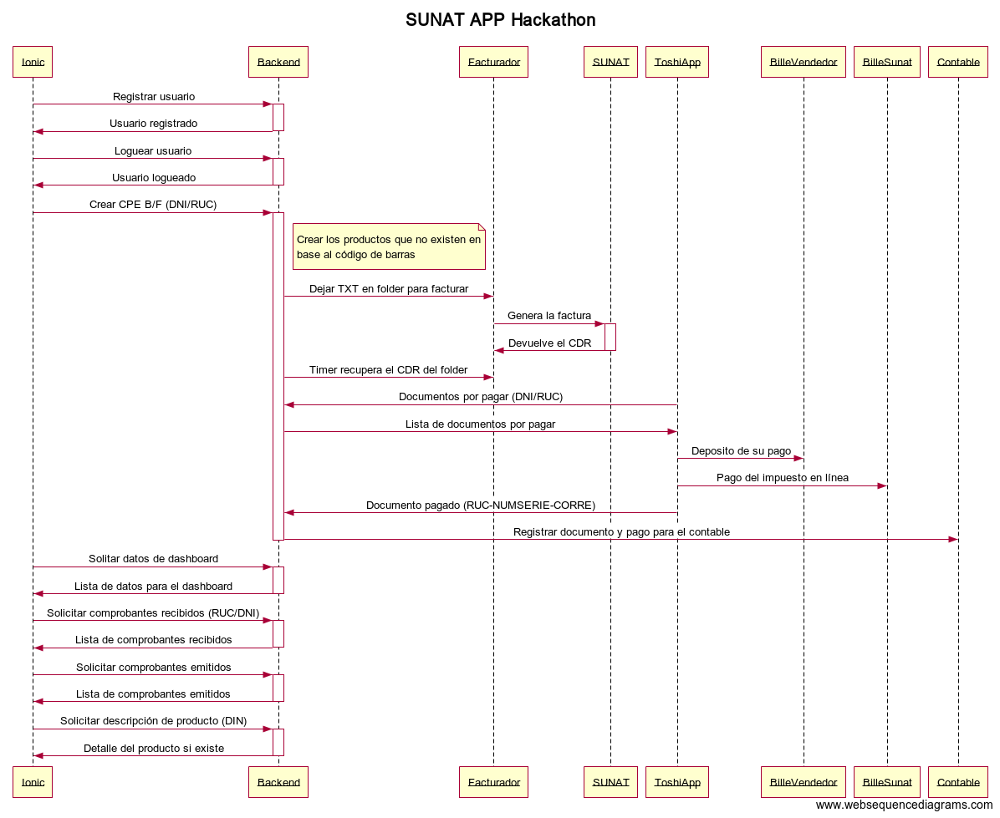

# SUNAT Hackathon TOSHI APP

La aplicación BOT en TOSHI para ejecutar los pagos online desde tu billetera privada de dinero digital.

Miembros del equipo:

* Juan José Miranda del Solar - Lider
* Alonso Rejas
* Manuel Hohagen Serpa
* Victor David Ramos Brast
* Roberto Principe - Documentador

## Diagrama de secuencia de los diferentes componentes de la aplicación

## Arquitectura del BOT "PAGUITO"

Deployar el BOT SUNAT TOSHI requiere algunos procesos para correr:

* **toshi-headless-client** 
  Este es el cliente que provee un wrapper alrededor de los servicios backend de Toshi (similiar al cliente iOS y Android). Este maneja también toda la encriptación de los mensajes extremo-a-extremo usando el protocolo SIGNAL. Está escrito en Java y corre en el background, proxeando todos los request desde el bot y hacia el bot.
* **redis** 
  Usamos redis pub/sub para proveer la conexión entre el toshi-headless-client y el bot PAGUITO.
* **bot.js** 
  Aquí es donde está toda la lógica del bot PAGUITO SUNAT.
* **postgres** 
  La base de datos Postgres es usada para almacenar toda la data de las sessiones con los usuarios, por lo cual se convierten en estados persistentes para cada usuario con quien el bot habla (similar a los cookies in un web browser), para que el bot interactue de una mejor manera con los usuarios que ya identificó.

